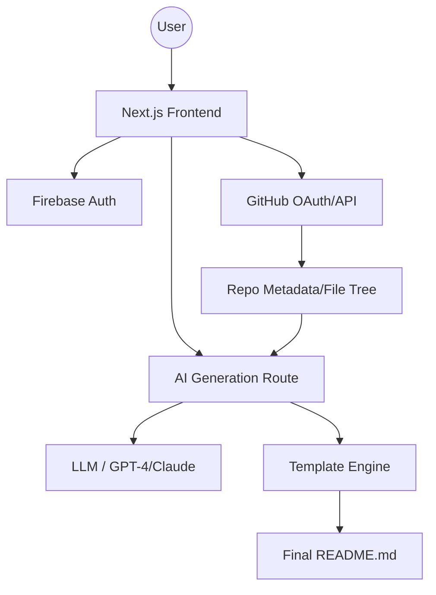

<div align="center">

# 🖋️ RepoScribe AI
### The Intelligent Engine for GitHub Profile Orchestration & README Synthesis

<div align="center">

[](https://nextjs.org)
[](https://www.typescriptlang.org)
[](https://tailwindcss.com)
[](https://firebase.google.com)
[](https://vercel.com)

</div>

**Transform your raw code repositories into professional, high-conversion documentation and profiles using generative AI.**

[Explore Docs](#-docs) • [Report Bug](https://github.com/dharunkumar-sh/repo-scribe/issues) • [Request Feature](https://github.com/dharunkumar-sh/repo-scribe/issues)

---

</div>

## 📖 Overview

**RepoScribe AI** is a high-performance AI SaaS designed to automate the tedious process of maintaining GitHub profiles and repository documentation. By leveraging a sophisticated template engine and LLM integration, it analyzes your codebase, understands project intent, and synthesizes production-grade `README.md` files and profile layouts.

Unlike static generators, RepoScribe utilizes a **Plugin-inspired Template Architecture**, allowing developers to define custom synthesis rules and structure logic that can be reused across multiple projects.

## 🚀 Key Features

| ⚡ Instant Synthesis | 🎨 Dynamic Templates | 📊 Profile Analytics | 🛠️ AI Orchestration |
| :--- | :--- | :--- | :--- |
| Auto-generate professional READMEs from repo analysis. | Choose from a library of curated, high-conversion layouts. | Track profile impact and repository visibility. | Context-aware AI that understands your tech stack. |
| **Live Preview** | **Customization** | **OAuth Integration** | **Version Control** |
| Real-time markdown rendering as you edit. | Fine-tune AI prompts and structural blocks. | Seamless GitHub authentication via OAuth. | Maintain multiple versions of your profile. |

## 🛠 Tech Stack

- **Frontend**: `Next.js 15 (App Router)`, `TypeScript`, `Tailwind CSS v4`
- **Animations**: `Framer Motion` (for fluid, high-end UI transitions)
- **State Management**: `Zustand` (Global store), `TanStack Query` (Server state)
- **Backend/Auth**: `Firebase Auth` & `Firebase Realtime Database`
- **AI Layer**: Custom AI routes via `/api/ai` for profile and README generation
- **Markdown**: `react-markdown` with `rehype-raw` and `remark-gfm`

## 📐 Architecture



---

## 🧩 Plugin & Template Ecosystem

RepoScribe is built on a modular "Plugin" philosophy. The `lib/templateEngine.ts` acts as the core orchestrator, allowing for the injection of custom synthesis blocks.

### 🛠️ Plugin Authoring Guide
You can extend RepoScribe by creating custom template definitions in `lib/templates.ts`. A "Plugin" in RepoScribe is essentially a structural definition that maps repository metadata to markdown sections.

**Example Template Definition:**
```typescript
export const MyCustomPlugin = {
  id: 'modern-saas-layout',
  name: 'Modern SaaS',
  blocks: [
    { section: 'Hero', priority: 1, prompt: 'Generate a high-converting hero section...' },
    { section: 'TechStack', priority: 2, prompt: 'Extract dependencies from package.json...' },
    { section: 'API_Reference', priority: 3, prompt: 'Analyze /api folder for endpoints...' },
  ],
  styling: 'glassmorphism'
};
```

### 🪝 Core API Hooks
The system provides internal hooks to interact with the generation pipeline:

- `useGithubStore`: Accesses authenticated GitHub user data and repository lists.
- `useDashboardStore`: Manages the current generation state and active templates.
- `templateEngine.process()`: The primary method to merge AI output with structural templates.

### 📦 Registry Publishing
To contribute a new template/plugin to the RepoScribe registry:
1. Define your template in `lib/templates.ts`.
2. Add the metadata to `lib/templateContent.ts`.
3. Submit a PR to the `app/dashboard/templates` directory to make it available in the UI.

---

## 🏁 Getting Started

### Prerequisites
- Node.js 18+ 
- A Firebase Project (for Auth/DB)
- GitHub OAuth App credentials

### Installation
```bash
# Clone the repository
git clone https://github.com/dharunkumar-sh/repo-scribe.git
cd repo-scribe

# Install dependencies
npm install

# Setup environment variables
cp .env.example .env.local
```

### Environment Variables
```env
NEXT_PUBLIC_FIREBASE_API_KEY=your_key
NEXT_PUBLIC_FIREBASE_AUTH_DOMAIN=your_domain
GITHUB_CLIENT_ID=your_github_id
GITHUB_CLIENT_SECRET=your_github_secret
AI_API_KEY=your_ai_provider_key
```

### Execution
```bash
npm run dev
```
Visit `http://localhost:3000` to start generating.

## 📂 Folder Structure

<details>
<summary>Click to expand file tree</summary>

```text
repo-scribe/
├── app/
│   ├── api/                # Backend routes (AI & GitHub)
│   │   ├── ai/             # Generation logic (README/Profile)
│   │   └── github/         # OAuth & Repo fetching
│   ├── dashboard/          # User workspace
│   │   ├── generate/       # The synthesis engine UI
│   │   ├── repositories/   # Repo management
│   │   └── components/     # Dashboard-specific UI (GlassCard, etc.)
│   ├── components/         # Global UI components (Hero, Navbar, CTA)
│   └── layout.tsx          # Root layout
├── context/                # React Contexts (Auth, History)
├── lib/                    # Core Business Logic
│   ├── templateEngine.ts   # The "Brain" of the synthesis
│   ├── github.ts           # GitHub API wrappers
│   └── types.ts            # Global TypeScript interfaces
├── store/                  # Zustand state stores
└── public/                 # Static assets
```
</details>

## 🚀 Deployment

The project is optimized for **Vercel**.

1. Push your code to GitHub.
2. Import the project into Vercel.
3. Add the environment variables listed in the "Getting Started" section.
4. Deploy.

## 🤝 Contributing

We welcome contributions! Whether it's a new AI prompt, a beautiful template, or a bug fix:
1. Fork the Project.
2. Create your Feature Branch (`git checkout -b feature/AmazingFeature`).
3. Commit your Changes (`git commit -m 'Add some AmazingFeature'`).
4. Push to the Branch (`git push origin feature/AmazingFeature`).
5. Open a Pull Request.

## 📄 License
This project is currently under a proprietary license. Please contact the maintainer for usage rights.

---

<div align="center">
Built with ❤️ by <a href="https://github.com/dharunkumar-sh">Dharun Kumar</a>
</div>
